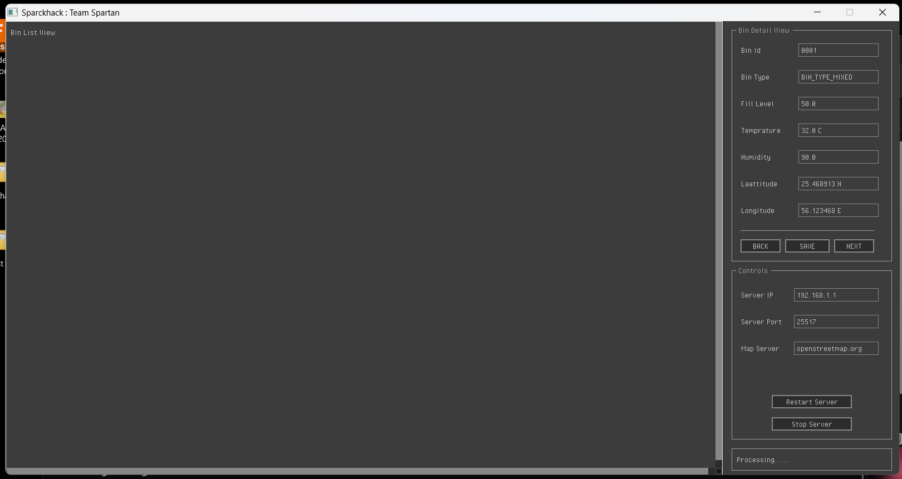

<h1>Convolution 2025</h1>
<h3>Event : Sparckhack</h3>
<h4><Team : Spartan</h4>

 Problem Statment : Smart Waste Management System : ( PS 1 )
                  Develop a waste management solution that optimizes waste collection
                  routes by analyzing real-time data from IoT-enabled smart bins. These bins
                  may be equipped with sensors to monitor fill levels, waste types, and
                  environmental factors such as temperature and moisture, transmitting data
                  via IoT protocols (e.g., LoRaWAN, Zigbee, or cellular networks) to a
                  centralized system. The system may dynamically adjust collection routes
                  using AI-powered algorithms that account for bin capacity, waste
                  categorization (e.g., recyclables, organic waste), and real-time traffic data
                  sourced from APIs. Additionally, image recognition and machine learning
                  algorithms may analyze waste at the source to identify and classify
                  recyclable materials, supporting efficient segregation at source. 

This is the code for a smart bin which can communicate its status to a central server for emptying and monitoring.

The main function is in the application.c file.

